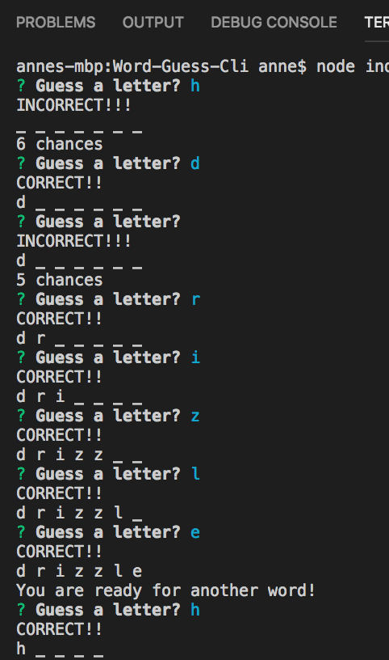
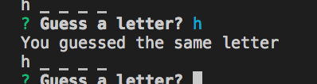
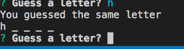

# Word-Guess-Cli

# Summary

Word-Guess-Cli is a word guessing game app.
If the users guess the word correctly, they move on to a new word.
Users have several tries before moving on to a new word.

## To Get Started

To get started with the app, go to index.js. Get into the terminal for index.js.
Then type the command node index.js. The game will start.

## Screenshots

Screenshots are provided below for the Word-Guess-Cli.

## More Info On Word-Guess-Cli

This app is updated and maintained by the Github user ac5599656. If you have further questions, you can email
ac5599656@gmail.com

## Technology Used

JavaScript/Node/Inquirer.js
